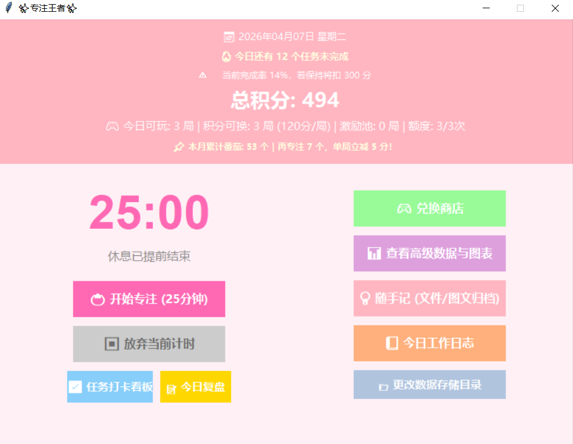
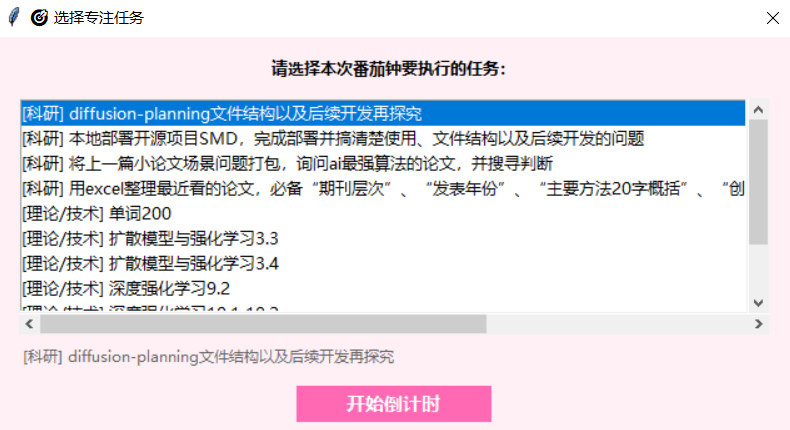
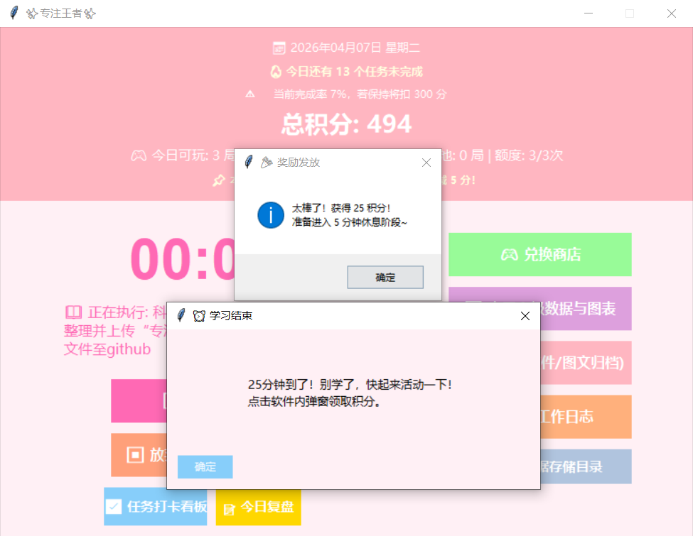
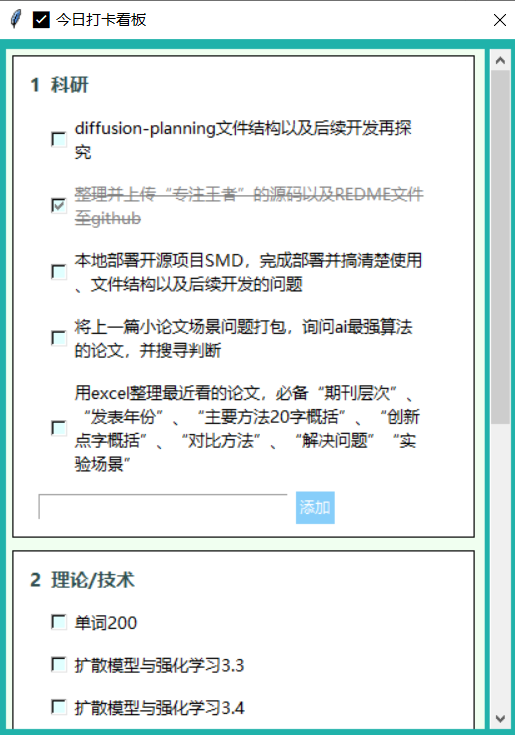
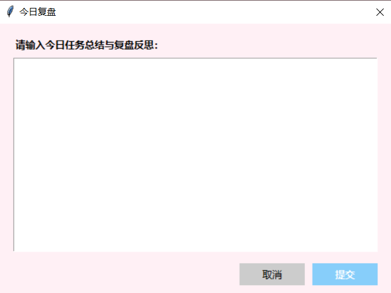
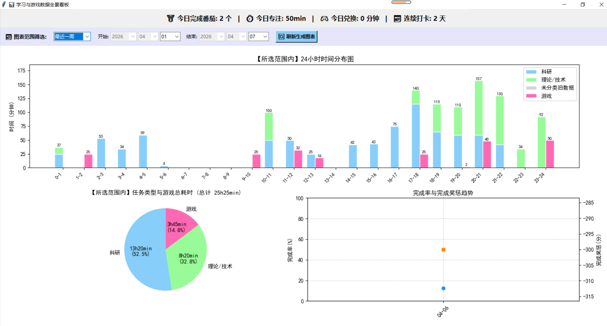
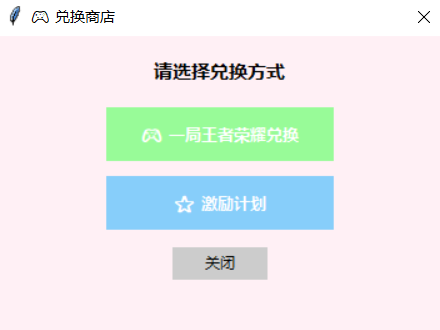
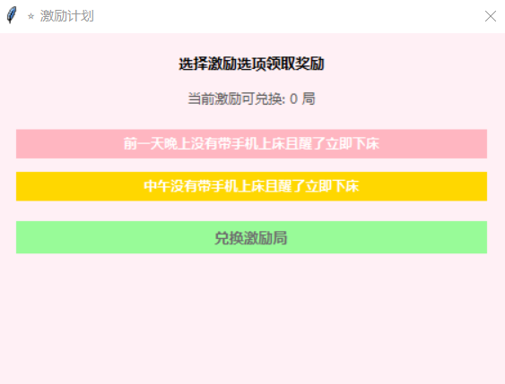
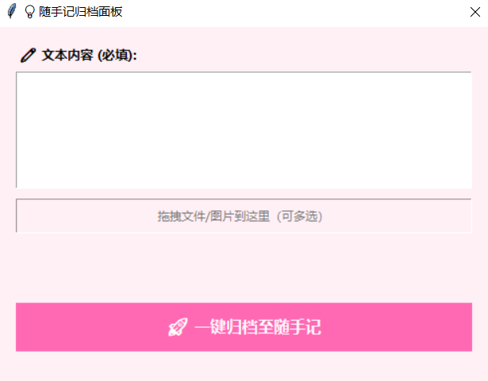
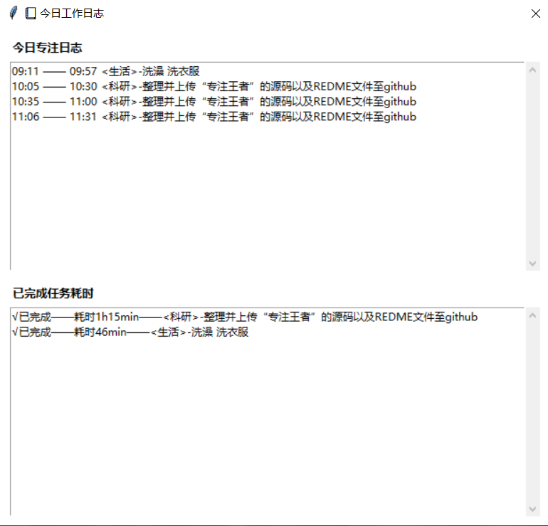

# 专注王者（Study Game Pro）

一个结合番茄钟、任务清单、复盘与游戏兑换奖励的自律工具（Tkinter GUI）。



## 1. 依赖安装与运行命令

### 环境要求
- Windows 10/11
- Python 3.8+（推荐 3.10+）

### 安装依赖
本项目主要依赖标准库与以下第三方库：

```bash
pip install matplotlib numpy
```

可选功能依赖（不装也能运行，但建议安装）：

```bash
pip install tkinterdnd2 win10toast
```

> 说明：
> - `tkinterdnd2` 用于随手记的拖拽上传。
> - `win10toast` 用于 Windows 系统通知。

### 运行命令
在项目根目录执行：

```bash
python study_game_pro.py
```

## 2. 第一次使用注意事项

- **首次启动必须选择一个“数据存储根目录”**，未选择会直接退出。
- 程序会在该根目录下创建/使用：
  - `专注改变（个人软件数据）`
- **所有数据都存放在该文件夹内**：
  - `study_game_reward.json`
  - `daily_tasks_log.txt`
  - `随手记.txt`
  - `随手记/`（图片与附件按日期归档）
- 如果需要更改数据存储路径，可在软件右侧点击“更改数据存储目录”。
- 软件支持防多开，同一时间只允许一个实例运行。

## 功能特性
- **番茄钟专注管理**: 集成经典番茄工作法，针对“科研”、“理论/技术”类别进行专注度追踪。
- **自定义打卡任务**: 每日动态任务看板，并且针对“生活”、“兴趣爱好”提供弹窗手动记录时间的功能。
- **长期任务系统**: 增加动态注入的长期目标（例如：坚持30天的“单词100”任务），带有每日目标耗时强制要求。
- **数据报表与导出**: 丰富的数据图表统计分析、每日专注与兑换折线图，生成详细的历史记录 CSV 报表（基于时间切割）。
- **游戏化体验与积分兑换**: 用学习换积分，用积分兑换自己定下的“娱乐时间”。
- **强大的总结与归纳**: 每日强制工作日志、睡前零点前复盘强提醒、以及全格式无缝拖拽的个人“随手记”系统。

## 2.1 数据目录结构

```
<你选择的根目录>
└─ 专注改变（个人软件数据）
  ├─ study_game_reward.json
  ├─ daily_tasks_log.txt
  ├─ 随手记.txt
  └─ 随手记
    └─ 2026-04-13
      └─ example.png
```

## 3. 主要功能介绍

- **番茄钟专注**：25 分钟专注 + 5 分钟休息，支持任务绑定与更换。
  
  
  

- **每日任务清单**：按类别管理任务，支持打卡与完成率统计。
  - 未完成任务会自动带入次日，直到完成为止。
  - 取消未完成任务需填写原因，并按次数扣分（20/40/80...），每月重置。
  
  

- **自动奖惩与复盘**：每日完成率结算，记录奖励/惩罚日志。
  
  

- **数据统计与图表**：学习时间分布、任务占比、奖励曲线等图表。
  
  

- **游戏兑换系统**：积分兑换游戏时间，带防沉迷与激励池。
  
  
  

- **随手记归档**：文本 + 文件/图片归档，按日期整理。
  
  

- **工作日志**：按任务聚合今日专注耗时；每日会自动归档所有任务耗时（含兴趣爱好）。
  
  

## 4. Windows 打包为 .exe

推荐使用 PyInstaller：

### 1) 安装打包工具

```bash
pip install pyinstaller
```

### 2) 打包命令（单文件模式）

在项目根目录执行：

```bash
python -m PyInstaller --onefile --noconsole --name change_self study_game_pro.py
```

参数说明：
- `-F`：打包为单个 exe 文件。
- `-w`：窗口模式（不显示黑色命令行）。
- `-n`：自定义生成的 exe 名称。

### 3) 打包产物

- 生成的 exe 位于 `dist/change_self.exe`。

> 备注：
> - 若打包后运行缺少字体或通知功能，请确保目标系统已安装对应字体或安装可选依赖。
> - 如需更小体积，可尝试去掉不必要的依赖或改为目录模式。
> - 如需中文文件名，可在打包完成后手动重命名 exe。

## 5. 更新日志

- v0.1.0 (2026-04-07)
  - 初始版本：番茄钟、任务清单、复盘、统计图表、随手记、兑换系统。

## 6. License

本项目采用 MIT 许可证，详见 [LICENSE](LICENSE)。
